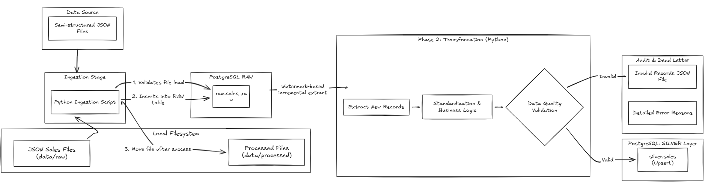
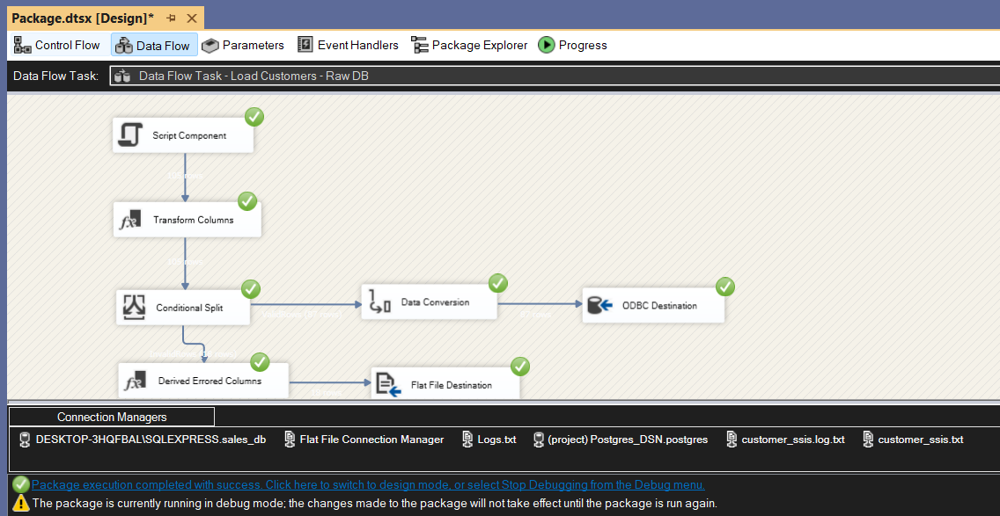
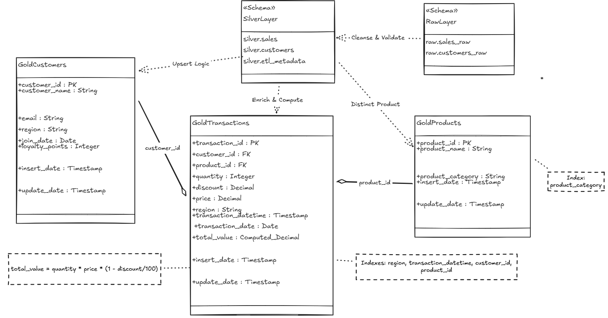
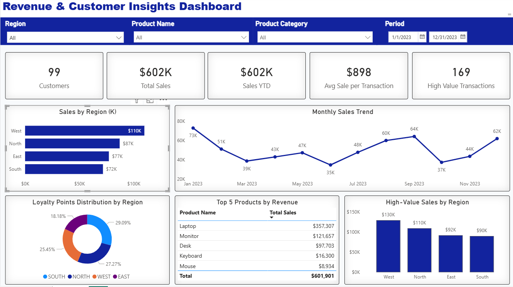

# Customer Revenue Analytics Platforms

## Executive Summary

This project delivers an end-to-end data engineering solution that ingests semi-structured sales and customer data, applies robust validation and incremental processing, and exposes analytics-ready datasets for business intelligence consumption in Power BI.

The solution demonstrates:

- Production-grade ETL design using **Python and SSIS**
- **Incremental and idempotent** data processing
- Layered data modeling (**Raw → Silver → Gold**)
- Strong **data quality enforcement and observability**
- Analytics optimization for **BI workloads**

The architecture and implementation patterns are aligned with real-world enterprise data platforms such as **Microsoft Fabric**, **Databricks**, and **Airflow-based batch systems**.

---

#### Project Structure

```
sales-and-customer-analytics-platform/
│
├── data/
|    ├── raw/                     # Incoming JSON file(landingzone)
|    ├── processed/               # Successfully ingested files
|   
├── etl_pipeline/
│   ├── sales_data_generation.ipynb
│   ├── sales_etl_pipeline.ipynb
│   └── src/
│       ├── sales_etl_functions.py
│       └── utils/
│         ├── config.py
│         └── logger.py
├──logs/
|    ├── sales_etl_logs.log       # Pipeline execution logs
|    ├── invalid_sales.json       # Invalid records with DQ errors
|    ├── customer_etl_logs.txt    # SSIS Pipeline execution logs
|    ├── invalid_customers.csv    # Invalid records with DQ errors
|
├── sql/
|    ├──gold/
|       ├── schema.sql
|       ├── indexes.sql
|       └── analytical_queries.sql
|       └── query_screenshots/
|
|    ├──raw/
|       ├── schema.sql
|    ├──silver/
|       ├── schema.sql
|       ├── silver_customer.sql   # SSIS SQL Script – Customer UPSERT Query
│
├── ssis/
│   ├── CustomerData.dtsx
│
├── powerbi/
│   ├── Revenue_Customer_Insights.pbix
├
└── README.md 

```

## Part 1: Python Data Pipeline – Sales JSON Source

### Objective

Design and implement a Python-based ETL pipeline that processes semi-structured sales data in JSON format and loads it into a PostgreSQL database using production-grade data engineering patterns.

The pipeline is designed to:

- Scale from small sample data to hundreds of records
- Handle real-world data quality issues
- Support incremental processing
- Ensure repeatable and fault-tolerant execution

---

### Dataset Description

**Source:** `sales_data.json`

The dataset contains transactional sales records with nested product attributes and intentionally inconsistent formats.

**Key challenges:**

- Nested JSON structures (`product` object)
- Multiple date formats
- Missing and null fields
- Invalid business values (e.g., negative quantity)
- Mixed discount representations

To simulate real-world scale, the base dataset was programmatically expanded to **500–1,000 records**.

---

### Sales Data Generation Strategy

A custom data generation script was created to test pipeline robustness and data quality logic.

**Key characteristics:**

- Duplicates and modifies base records
- Preserves referential integrity for valid customer IDs
- Injects controlled data quality issues:
  - Null customer IDs
  - Negative quantities
  - Missing or invalid discounts
- Randomizes:
  - Transaction timestamps (within 2023)
  - Regions
  - Product prices (slight variations)

**Purpose:**

This approach enables evaluation of:

- Realistic data errors
- Validation logic
- Error handling
- Restartability
- Downstream analytics readiness

Generated data is written to the **raw data layer** as JSON files.

---

### ETL Architecture Overview

The Python pipeline follows a **Raw → Silver** layered architecture, commonly used in modern analytics platforms.




---

### Database Layers & Schema

| Layer | Table | Description |
|-----|------|-------------|
| Raw | raw.sales_raw | Append-only ingested sales data |
| Silver | silver.sales | Cleaned, validated, deduplicated sales |
| Silver | silver.etl_metadata | Stores incremental load watermark |

---

### ETL Flow Details

#### Extract – File to Raw Layer

- Reads JSON files from `data/raw/`
- Inserts records into `raw.sales_raw`
- Adds `insert_date` ingestion timestamp
- Moves processed files to `data/processed/`

Missing or empty files are logged and skipped without crashing the pipeline.

---

#### Incremental Processing Logic

- Reads last processed watermark from `silver.etl_metadata`
- Extracts only records where:

```
insert_date > last_insert_date
```

- First run defaults watermark to `1900-01-01` (full load)

---

#### Transform & Data Quality Validation

Transformations are implemented using **vectorized Pandas operations**.

**Key transformations:**

- Normalize customer IDs
- Standardize date formats
- Fill missing discounts with `0`
- Add audit columns (`update_date`)

**Data quality rules:**

Records are marked invalid if:

- `transaction_id` is NULL
- `customer_id` is NULL
- `price` is NULL
- `quantity <= 0`
- `discount` not in `[0,1]`

Invalid records receive a human-readable `dq_errors` field.

Valid and invalid records are handled explicitly.

---

#### Load – Silver Layer

- Target table: `silver.sales`
- Load strategy: **UPSERT** on `transaction_id`

This ensures:

- Idempotent pipeline runs
- No duplicate transactions
- Safe reprocessing

---

#### Metadata Update & Logging

- Updates watermark in `silver.etl_metadata`
- Invalid records written to `logs/invalid_sales.json`
- Structured logging stored in `logs/sales_etl_logs.log`

---

## Part 2: SSIS Pipeline – Customer Data Processing

### Objective

Design a restartable, parameterized, production-ready SSIS pipeline to ingest customer data from a JSON source, validate it, load clean data into PostgreSQL, and capture invalid records.

---

### High-Level Architecture


The SSIS pipeline follows a **Raw → Silver** architecture.

**Target Tables:**

- `raw.customers_raw`
- `silver.customers`

**Error Output:**

- `invalid_customers.csv`

---

### Control Flow Design


1. **Data Flow Task**
 - Extracts JSON data
 - Applies transformations and validation
 - Loads valid records into raw layer
 - Redirects invalid records

2. **Execute SQL Task**
 - UPSERT from raw to silver
 - Prevents duplicates

3. **Checkpoint Configuration**
 - Enables restart from last successful task

4. **Move File Task**
 - Moves processed JSON file to processed folder

---

### Data Flow Design



- **JSON Source:** Parameterized file path
- **Derived Column:**
- Trim text
- Normalize emails
- Add audit columns
- **Conditional Split:**
- Separates valid and invalid records
- **ODBC Destination:** Raw layer
- **Flat File Destination:** Invalid records logging

---

### Parameters & Variables

**Parameters:**

- `p_SourceFilePath`
- `p_ConnectionString`

**Variables:**

- `JSONfilePath`
- `DestJSONfilePath`

Supports seamless deployment across environments.

---

## Part 3: Database Design & SQL Optimization

### Layered Architecture



- **Raw:** Audit and replay
- **Silver:** Clean, validated data
- **Gold:** Analytics-optimized star schema

---

### Gold Layer Data Model

- `gold.customers`
- `gold.products`
- `gold.transactions`

Computed metric:

```
total_value = quantity × price × (1 - discount)
```


UPSERT-based promotions ensure idempotency and safe re-runs.

---

### Indexing Strategy

Indexes are designed for joins, filters, and aggregations:

- Date-based indexes for trends
- Foreign key indexes for joins
- Composite indexes for region + date analytics

This significantly improves BI query performance.

---

### Analytical SQL Queries

Includes:

1. Total sales by region and category
2. Top 5 products by revenue
3. Monthly sales trend
4. Average discount per region
5. High-value transactions (> $1000)

---

## Part 4: Power BI Dashboard – Revenue & Customer Insights

### Objective



Visualize key revenue, customer, and product performance metrics using Gold layer tables.

**Data Sources:**

- `gold.transactions`
- `gold.products`
- `gold.customers`

---

### Visuals Implemented

- Bar Chart – Total Sales by Region
- Line Chart – Monthly Sales Trend
- Table – Top 5 Products by Revenue
- KPI Cards:
  - Total Customers
  - Total Sales
  - Average Sale per Transaction
  - High-Value Transactions
  - Sales YTD
- Donut Chart – Loyalty Points by Region

---

### DAX Measures

- Total Sales
- Average Sale per Transaction
- Total Loyalty Points
- High-Value Transactions (> $1000)
- Sales YTD

---

### Key Insights

- West region leads total sales
- Sales peaks in January, September, and December
- Laptops generate highest revenue
- 169 high-value transactions (> $1000)
- South region has highest loyalty engagement

---

## Production Deployment Recommendations

If deployed in a production environment, the following enhancements are recommended:

### Orchestration
- Schedule Python ETL using Airflow, Azure Data Factory, or Fabric Pipelines
- Implement dependency-aware DAGs and SLA monitoring

### Storage & Compute
- Replace local file storage with cloud object storage (ADLS / S3)
- Migrate PostgreSQL to managed services (Azure SQL / Cloud SQL)

### Observability
- Centralize logs using Azure Monitor, ELK, or Datadog
- Add row count reconciliation and freshness checks

### Data Quality
- Externalize DQ rules into configuration tables
- Add alerting for threshold-based failures

### Security & Governance
- Use secret management (Key Vault / AWS Secrets Manager)
- Implement role-based access on Gold layer tables

These enhancements would allow the solution to scale to millions of records
while maintaining reliability, security, and maintainability.


## Conclusion

This solution demonstrates:

- End-to-end data engineering expertise
- Production-grade ETL design
- Robust data quality handling
- Scalable, analytics-ready architecture
- Clear documentation and observability

It provides a strong foundation for real-world enterprise analytics platforms and BI workloads.