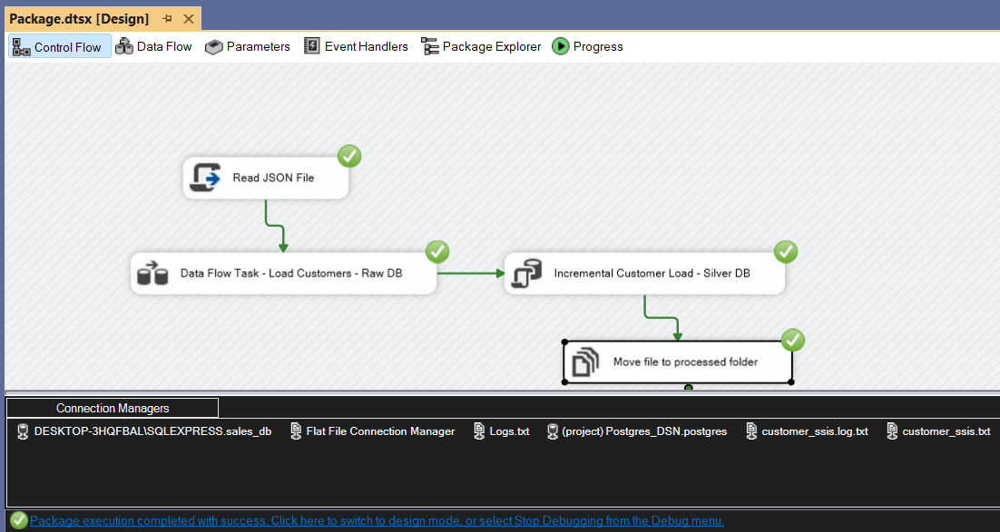

# SSIS Pipeline – Customer Data Processing (JSON Source)

---

## Overview

This repository contains an **enterprise-grade SSIS ETL pipeline** designed to ingest (`customer_data.json`) from a semi-structured JSON source, apply validation and transformations, load it into PostgreSQL using a **Raw → Silver layered architecture**, and capture invalid records into an ``invalid_customers.csv`` for audit and troubleshooting.

The pipeline is **restartable, parameterized, idempotent, and production-ready**, following modern data engineering best practices.

This SSIS implementation complements a Python-based sales ETL pipeline and demonstrates strong proficiency in **SSIS Control Flow orchestration, Data Flow transformations, error handling, checkpoint-based recovery, and layered data architecture.**

## Objective

The primary objectives of this SSIS pipeline are to:

- Ingest customer data from a JSON file (customer_data.json)
- Validate and standardize incoming records
- Load valid records into a relational database
- Capture and persist invalid records for audit and replay
- Ensure restartability and fault tolerance using SSIS checkpoints
- Support multi-environment deployment (DEV / UAT / PROD) via parameterization

## High-Level Design

The pipeline follows a **Raw → Silver layered architecture**, consistent with modern data platform design principles.

#### Architecture Flow

Invalid records are redirected to a dedicated error output for full traceability.

This design ensures:

- Clean separation between ingestion and consumption layers
- Data lineage and auditability
- Safe reprocessing and recovery
- Scalable downstream consumption

## SSIS Package Overview

| Attribute        | Value                     |
|-----------------|---------------------------|
| Package Name     | package.dtsx              |
| Source Type      | JSON File                 |
| Target Database  | PostgreSQL                |
| Raw Table        | raw.customers_raw         |
| Silver Table     | silver.customers          |
| Error Output     | invalid_customers.csv     |

**Notes:**  
The package is designed to be **configurable**, **idempotent**, and **environment-agnostic**.

The pipeline performs ETL steps:

### Extract
- Read customer data from a JSON file  
- File location is configurable via parameters  

### Transform
- Standardize data formats  
- Apply business rules and validations  
- Separate valid and invalid records  

### Load
- Insert clean records into the PostgreSQL  **Customers** table  
- Redirect invalid records to an **invalid_customers** flat file  

### Data Layers
- ``raw.customers_raw`` – landing table for validated JSON records
- ``silver.customers`` – cleansed and deduplicated customer data

---

## Control Flow Design

### Control Flow Components

The Control Flow orchestrates the end-to-end execution of the pipeline and enforces execution order, fault tolerance, and restartability.

#### Key Control Flow Components

#### 1. Data Flow Task – Load Customer Data

- Reads customer records from the JSON source
- Applies data transformations and validation logic
- Loads valid records into the raw layer
- Redirects invalid records to an error output file

#### 2. SQL Script Task – Customer UPSERT

A SQL Script Task is used in the Control Flow to execute an **UPSERT statement for customer data**, ensuring existing customers are updated and new customers are inserted without duplication.  
The task loads validated customer records from the ``raw.customers_raw`` table into the ``silver.Customers`` table, keeping customer data consistent and up to date.

This logic guarantees **idempotent and incremental processing**.

#### Assumptions
- Input JSON schema remains consistent
- Customer ID uniquely identifies a customer

#### 3. Checkpoint Configuration
- SSIS checkpointing is enabled at the package level
- Allows the package to resume from the last successfully completed task
- Prevents reprocessing of completed steps after failures

#### 4. Move File to Processed Folder

- After successful loading into the Silver layer:
  - ``customer_data.json`` is moved from the source folder to a ``processed`` folder

- This step ensures:
  - File-level idempotency
  - No accidental reprocessing of the same input file

## Data Flow Design

The Data Flow Task is responsible for extraction, transformation, validation, and routing.

### 1. JSON Source

- Reads input data from `customer_data.json`  
- JSON path and file location are parameterized  
- Supports schema inference for structured parsing  

**Key Fields Extracted:**
- `customer_id`
- `customer_name`
- `email`
- `region`
- `join_date`
- `loyalty_points`

---

### 2. Derived Column Transformation

Used to standardize and enrich incoming data before validation.

#### Key Transformations:

- Trim whitespace from text fields
- Normalize email addresses to lowercase
- Convert data types where required
- Create derived error-tracking columns for invalid records

Add audit column:

**Examples:**
- Lowercase `email`
- Add ``insert_date = GETDATE()``

This step ensures consistent formatting and supports downstream auditability.

### 3. Conditional Split

Applies data quality rules to separate valid and invalid records.

**Valid Records Criteria (example):**
- `customer_id IS NOT NULL`
- Additional rules can be easily extended:
  - Email format validation
  - Loyalty points range checks
  - Region code validation

**Outputs:**
- Valid Rows → SQL Destination (``raw.customers_raw``) 
- Invalid Rows → Error Logging flow  

Invalid data is never silently dropped and is fully traceable.

### 4. ODBC DB Destination – Customers Table

- Loads validated records into the **raw.customers_raw** table  
- Serves as a persistent landing layer
- Enables:
  - Reprocessing
  - Auditing
  - Troubleshooting

---

### 5. Error Handling & Logging

- File: invalid_customers.csv
- Captures:
  - Full rejected row values
  - Data quality failure indicators

This approach ensures:

- Zero data loss
- Full transparency
- Easy debugging and replay

---

## Variables & Parameters

The package uses SSIS **Parameters** and **Variables** for flexibility and environment portability.

### Parameters
- `p_SourceFilePath` – JSON file location  
- `p_ConnectionString` – Target database connection string  

### Variables
- `JSONfilePath` - Runtime source file location
- `DestJSONfilePath` - Destination path after processing

This design allows seamless deployment across environments without modifying the package.

---

## Checkpoint & Restartability

Checkpointing is enabled to support fault tolerance and reliablity.

**Behavior:**

If execution fails mid-run:
- The package resumes from the last completed task
- Previously processed steps are not re-executed

This is particularly useful for:

- Large files
- Scheduled or automated executions
- Production-grade reliability requirements 

---

## Data Validation Strategy

- Mandatory field checks via Conditional Split
- Data standardization using Derived Column
- Explicit separation of valid and invalid records
- Persistent audit trail for rejected data

This strategy ensures **high data quality without sacrificing availability**.

## Best Practices and Performance Considerations

- Fast Load enabled on database destinations
- Minimal transformations inside the Data Flow
- SQL-based UPSERT logic for efficiency
- Modular and extensible design
- Parameterized paths and connections
- Clear separation of responsibilities across layers 

## Outcome

This SSIS pipeline demonstrates:
- Strong control and data flow design
- Robust error handling and auditability
- Restartable, fault-tolerant execution
- Clean separation of concerns
- Enterprise-ready ETL engineering practices