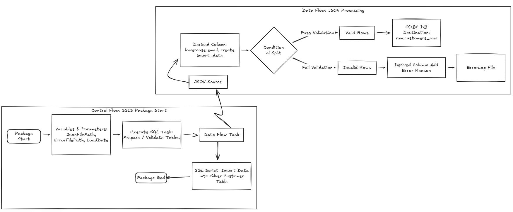

# SSIS Pipeline – Customer Data Ingestion

---

## Objective

The objective of this SSIS package is to ingest customer JSON data (`customer_data.json`), apply necessary transformations and validations, load it into a PostgresSQL  **Customers** table, and capture any bad or invalid records into an **ErrorLog** for audit and troubleshooting purposes.

The package is designed to be **restartable**, **configurable**, and **production-ready**, following ETL best practices.

---

## High-Level Design

The SSIS solution follows a classic **ETL pattern**:

### Extract
- Read customer data from a JSON file  
- File location is configurable via parameters  

### Transform
- Standardize data formats  
- Apply business rules and validations  
- Separate valid and invalid records  

### Load
- Insert clean records into the PostgreSQL  **Customers** table  
- Redirect invalid records to an **invalid_customers** flat file  

---

## Control Flow Design

### Control Flow Components

The SSIS package contains the following Control Flow elements:

#### Data Flow Task – Load Customer Data
- Main task responsible for extracting, transforming, and loading customer data  

#### Checkpoint Configuration
- Enables package restartability in case of failure  
- Ensures previously completed tasks are not re-executed  

---

## Data Flow Design

### 1. JSON Source

- Reads input from `customer_data.json`  
- JSON path and file location are parameterized  
- Supports schema inference for structured parsing  

**Key Fields Extracted:**
- `customer_id`
- `customer_name`
- `email`
- `region`
- `join_date`
- `loyalty_points`

---

### 2. Derived Column Transformation

Used to:
- Standardize text fields (e.g., trimming whitespace)
- Convert data types
- Add audit fields

**Examples:**
- Lowercase `email`
- Add `insert_date = GETDATE()`

---

### 3. Conditional Split

Applies data quality rules to separate valid and invalid records.

**Valid Records Criteria (example):**
- `customer_id IS NOT NULL`

**Outputs:**
- Valid Rows → SQL **Customers** table  
- Invalid Rows → Error Logging flow  

---

### 4. ODBC DB Destination – Customers Table

- Loads validated records into the **raw.customers_raw** table  

---

### 5. Error Handling & Logging

Invalid records are redirected to:

#### Flat File Error Log
- Useful for debugging and replay scenarios  

This ensures:
- No data loss  
- Full traceability of rejected records  

---

## Variables & Parameters

The package uses SSIS **Parameters** and **Variables** for flexibility and environment portability.

### Parameters
- `p_SourceFilePath` – JSON file location  
- `p_ConnectionString` – Database connection  

### Variables
- `JSONfilePath` - JSON file location

This allows easy deployment across **DEV / UAT / PROD** without package changes.

---

## Checkpoint & Restartability

Checkpointing is enabled to support fault tolerance.

**Behavior:**
- If the package fails mid-execution, it resumes from the last successful task  
- Prevents reprocessing of already loaded data  

This is critical for:
- Large files  
- Scheduled or unattended executions  

---

## Data Validation Strategy

- Mandatory field checks using **Conditional Split**  
- Type casting and null handling using **Derived Columns**  
- Invalid records are never discarded silently  

---

## Scaling & Performance Considerations

- **Fast Load** enabled on SQL destinations  
- Modular design allows:
  - Additional transformations
  - Parallel Data Flow Tasks
- Parameterized file paths support batch ingestion  

---

